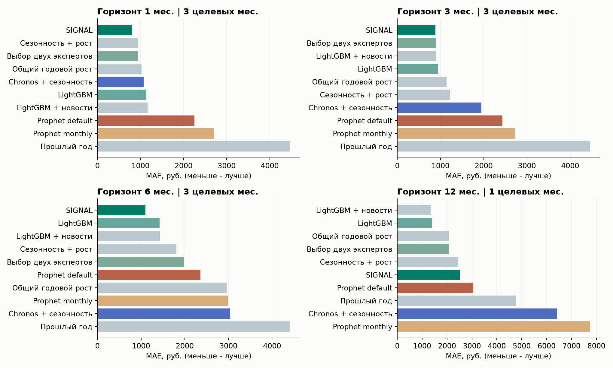
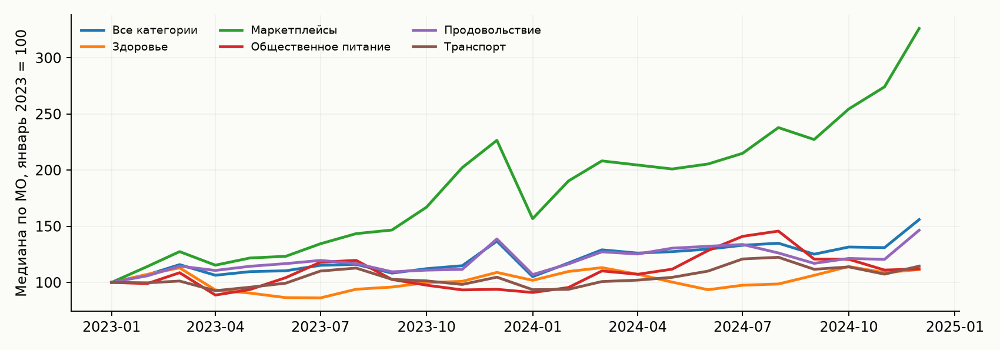
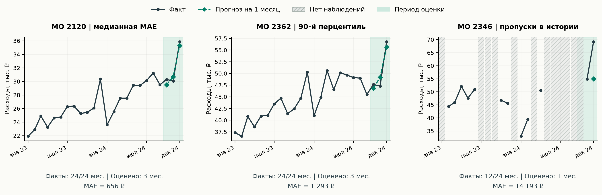
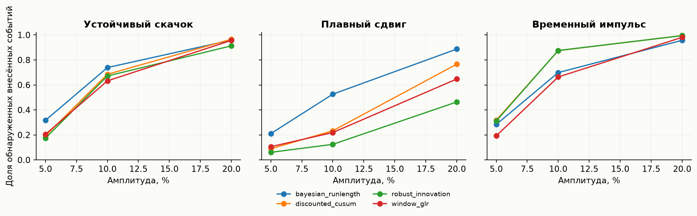

# Результаты воспроизводимого эксперимента

Дата подготовки: 01.10.2026. Числа автоматически рассчитаны из `results/full`.

## Прогноз: парное сравнение с Prophet

Основная цель: «Все категории». В таблице MAE в рублях, меньше - лучше. Все строки внутри горизонта оцениваются на одних и тех же наблюдениях заранее выбранных 512 МО. Наличие пропусков уменьшает число доступных пар.

| Модель                |        1 |        3 |        6 |        12 |
|:----------------------|---------:|---------:|---------:|----------:|
| SIGNAL                |  801.715 |  883.054 | 1101.240 |  2511.130 |
| Панельное сглаживание |  880.411 | 1016.830 | 1323.309 |  2078.121 |
| Сезонные отношения    |  925.788 | 1008.753 | 2677.555 |  2078.121 |
| Сезонность + рост     |  930.200 | 1218.273 | 1807.596 |  2432.944 |
| Выбор двух экспертов  |  949.560 |  897.801 | 1980.465 |  2078.121 |
| Общий годовой рост    | 1027.154 | 1139.128 | 2958.627 |  2078.121 |
| Chronos + сезонность  | 1074.296 | 1949.709 | 3031.824 |  6405.603 |
| Ridge + календарь     | 1087.627 | 1365.870 | 1380.268 |  3056.684 |
| LightGBM              | 1134.797 |  945.515 | 1421.191 |  1385.478 |
| LightGBM + новости    | 1165.379 |  904.106 | 1438.111 |  1336.798 |
| CatBoost              | 1229.502 | 1002.575 | 1553.670 |  2262.838 |
| Prophet default       | 2251.805 | 2431.175 | 2358.542 |  3054.258 |
| Затухающий тренд      | 2506.948 | 3439.378 | 2432.137 |  2749.962 |
| Последний месяц       | 2654.854 | 3202.200 | 3001.221 |  4771.593 |
| Prophet monthly       | 2706.437 | 2718.697 | 2986.562 |  7745.749 |
| Chronos исходный      | 3016.295 | 3565.739 | 5669.979 | 11079.437 |
| Прошлый год           | 4475.699 | 4460.639 | 4415.432 |  4771.593 |

Размеры выборки и относительное изменение MAE:

|   horizon |   mae_signal |   mae_prophet_default |   mae_prophet_monthly |   improvement_default_percent |   improvement_monthly_percent |        n |   target_months |
|----------:|-------------:|----------------------:|----------------------:|------------------------------:|------------------------------:|---------:|----------------:|
|     1.000 |      801.715 |              2251.805 |              2706.437 |                        64.397 |                        70.377 | 1478.000 |           3.000 |
|     3.000 |      883.054 |              2431.175 |              2718.697 |                        63.678 |                        67.519 | 1474.000 |           3.000 |
|     6.000 |     1101.240 |              2358.542 |              2986.562 |                        53.308 |                        63.127 | 1465.000 |           3.000 |
|    12.000 |     2511.130 |              3054.258 |              7745.749 |                        17.783 |                        67.581 |  479.000 |           1.000 |

Положительное improvement означает меньшую ошибку SIGNAL; отрицательное означает проигрыш. Годовой горизонт имеет только один старт и один целевой месяц. Нельзя интерпретировать его как многолетнюю проверку.

Основной вариант - исходный ансамбль `signal_ensemble`. Дополнительный `signal_adaptive` не улучшил его MAE на горизонтах 1,3,6, хотя оказался лучше на единственном годовом эпизоде. Это пример пользы усреднения различных ошибок: выбор двух экспертов по короткой прошлой истории может быть нестабильным. Основной вариант оставлен после сравнительного исследования; отдельного нового теста после этого выбора нет. Числа являются измерениями каждого зафиксированного метода в опубликованном backtest, а не независимой оценкой процедуры итогового выбора.

## Основной алгоритм на всей доступной панели

|   horizon |        n |      mae |    r2 |   wape |   target_months |
|----------:|---------:|---------:|------:|-------:|----------------:|
|     1.000 | 6245.000 |  780.244 | 0.992 |  0.024 |           3.000 |
|     3.000 | 6221.000 |  862.453 | 0.989 |  0.026 |           3.000 |
|     6.000 | 6185.000 | 1084.899 | 0.985 |  0.033 |           3.000 |
|    12.000 | 2043.000 | 2421.058 | 0.953 |  0.066 |           1.000 |

Результаты всех категорий и development-периода: `results/full/metrics.csv`. Интервалы парных разностей и доля выигранных МО: `paired_comparisons.json`. Оценка независимой временной неопределённости ограничена тремя тестовыми месяцами. Интервал для h=12 не вычисляется.

## Категории и реальные примеры

На графике индексируется медиана расходов каждой категории. Это описание изменения номинальных расходов, а не эффект определённой политики. Различия категорий обосновывают их отдельное моделирование.

| category             |   complete_municipalities |   median_annual_change_percent |   p10_annual_change_percent |   p90_annual_change_percent |   median_december_november_2024_percent |
|:---------------------|--------------------------:|-------------------------------:|----------------------------:|----------------------------:|----------------------------------------:|
| Все категории        |                      2016 |                         15.123 |                       9.801 |                      19.244 |                                  17.955 |
| Здоровье             |                      2016 |                          9.974 |                       0.439 |                      17.198 |                                   2.608 |
| Маркетплейсы         |                      2016 |                         54.029 |                      40.231 |                      82.043 |                                  19.262 |
| Общественное питание |                      2016 |                         18.468 |                      -5.114 |                      35.500 |                                   3.348 |
| Продовольствие       |                      2016 |                         10.633 |                       4.835 |                      14.189 |                                  21.463 |
| Транспорт            |                      2016 |                          8.852 |                      -4.706 |                      18.383 |                                   6.547 |

Для этой описательной таблицы используются полные ряды каждой категории. Годовое изменение - отношение среднего расхода за 2024 год к среднему за 2023 внутри одного МО; затем берутся медиана и перцентили между МО. Это невзвешенная характеристика территорий, а не темп роста потребления всего населения России. Размах 10-90% показывает неоднородность локальной динамики. Декабрьское изменение к ноябрю помогает увидеть сезонность, которую простая экстраполяция тренда пропускает. Инфляция и переход к безналичным платежам отдельно не идентифицированы.

|   territory_id | selection_rule         |   test_mae_h1 |   last_observed |   january_2023 |
|---------------:|:-----------------------|--------------:|----------------:|---------------:|
|           2120 | Медианная ошибка       |       656.198 |       35852.000 |      21923.000 |
|           2362 | 90-й перцентиль ошибки |      1293.050 |       56766.000 |      37333.000 |
|           2346 | Наибольшая ошибка      |     14193.325 |       69159.000 |        nan     |

Примеры выбраны по заранее заданному правилу: медианная, 90-процентильная и наибольшая ошибка одношагового прогноза. Они показывают обычный и трудные случаи, а не только удачные истории. Выбор для иллюстрации использует test и не считается отдельной проверкой качества. Названия МО неизвестны; сопоставление с конкретными городами не выдумано.

## Абляция реальных новостей

|   horizon |   lightgbm |   lightgbm_news |   news_improvement_percent |
|----------:|-----------:|----------------:|---------------------------:|
|     1.000 |   1113.413 |        1150.379 |                     -3.320 |
|     3.000 |    924.334 |         893.631 |                      3.322 |
|     6.000 |   1484.720 |        1504.273 |                     -1.317 |
|    12.000 |   1376.445 |        1308.610 |                      4.928 |

Сравниваются одинаковые LightGBM с/без доступных на дату старта новостных признаков. Улучшение может быть отрицательным. Это проверка небольшого корпуса официальных федеральных публикаций; перенос результата на широкий поток местных новостей не доказан.

## Детекторы: только полусинтетические события

Рабочий метод, выбранный на отдельной калибровочной группе: `bayesian_runlength`. В таблице средние по 27 сценариям (3 амплитуды × 3 типа × 3 повтора) на других МО.

| model              |   recall |   precision |    f1 |   false_alarms_per_100 |   median_delay_detected |
|:-------------------|---------:|------------:|------:|-----------------------:|------------------------:|
| bayesian_runlength |    0.620 |       0.417 | 0.490 |                  3.173 |                   0.667 |
| discounted_cusum   |    0.569 |       0.377 | 0.442 |                  2.850 |                   0.481 |
| robust_innovation  |    0.510 |       0.417 | 0.451 |                  2.508 |                   0.407 |
| window_glr         |    0.511 |       0.342 | 0.396 |                  2.723 |                   0.593 |

Recall и precision относятся к внесённым изменениям. Контрольные ряды остаются реальными и могут содержать собственные изменения. Частоты ложных тревог близки, но не идентичны; сравнение не выдаётся за тест при строго равной FAR. Задержка посчитана только для найденных событий.

## Предупреждение на месяц вперёд

| model            |   average_precision |   roc_auc |   brier |   prevalence |
|:-----------------|--------------------:|----------:|--------:|-------------:|
| constant_prior   |               0.043 |     0.500 |   0.041 |        0.043 |
| history_and_news |               0.254 |     0.841 |   0.038 |        0.043 |
| history_only     |               0.252 |     0.839 |   0.038 |        0.043 |

Это макросреднее по трём месяцам, а не метрики одного объединённого пула. Цель - крупное относительное изменение следующего месяца, **статистический proxy**, не подтверждённый экономический шок. Average precision сравнивается с распространённостью события; Brier - ошибка вероятностного прогноза.

Файл `preannounced_events.json` отдельно содержит календарные предупреждения из публикаций до будущего заседания. Эти записи знают дату события, но не его будущий исход.

## Аудит

* Наблюдений: 303,126; уникальных МО: 2190; категорий: 6.
* Месяцев: 24; полных МО для детекторов: 2016.
* Пропущенных ячеек панели: 12,234; пропущенные факты не оцениваются.
* SHA-256 consumption.parquet: `9833ddaaee7b2a182ed4cceeed16469031700ea87d508bd976150c6770ef8a61`.
* СберИндекс, CC BY-SA 4.0. Новости: Пресс-служба Банка России. Источники и ограничения подробно перечислены в [методологии](METHODOLOGY.md).
